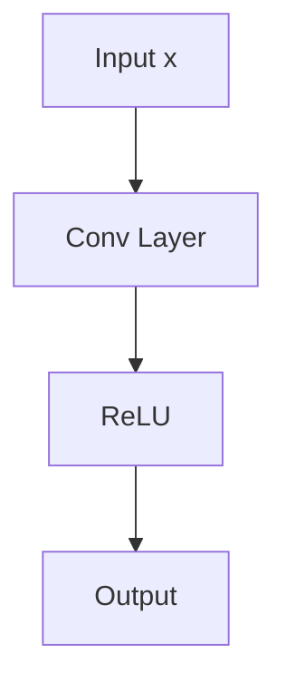
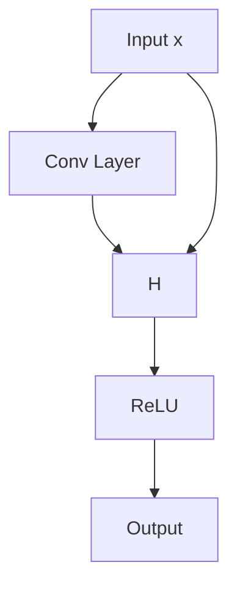

# Lecture 6: CNN Architectures

## History

AlexNet(2012. 8 layers) -> VGG(2014, 16-19 layers) -> GoogLeNet(2014, 22 layers) -> ResNet(2015, **152** layers) -> DenseNet(2016)

### AlexNet & VGG

AlexNet and VGG: 3x3 conv filters, ReLU, max-pooling, and with fully-connected layers at the end; smaller filters, deeper networks. For example, stack of three 3x3 conv layers has same receptive field as one 7x7 conv layer, but with less parameters and more non-linearity.

### Why they only uses few layers?

What happens if we continue stacking deeper layers (on these traditional/plain) CNN?

It turns out that **50 layers CNN performs worse than 20 layers.** It's not caused by overfitting, the possible explanation is that:

1. vanishing/exploding gradients
2. local minima
3. degradation problem: as we add more layers, training error increases.

## Residual Networks(ResNet)

Use network layers to fit a residual mapping instead of the original mapping.

Plain/traditional network:



Identity mapping, ResNet:

<!-- TODO: this prob not correct -->



## Weight Initialization

- value too small -> vanishing gradients
- value too large -> exploding gradients

**Kaiming He Initialization** (for ReLU activations):

```python
import numpy as np


dims = [4096] * 7

hs = []

x = np.random.randn(16, dims[0])

# test for forward pass
for di, do in zip(dims[:-1], dims[:-1]):
  # W = np.random.randn(di, do) * .05  # .1 will overflow .01 will vanish
  W = np.random.randn(di, do) * np.sqrt(2 / di)  # Kaiming He initialization
  x = np.maximum(0, x.dot(W))
  hs.append(x)


# plot each layer's mean and std
for i, h in enumerate(hs):
  print(f"Layer {i + 1}: mean={h.mean():.5f}, std={h.std():.5f}")
```

Possible output:

```log
Layer 1: mean=0.56139, std=0.82481
Layer 2: mean=0.56245, std=0.82461
Layer 3: mean=0.55005, std=0.81188
Layer 4: mean=0.53608, std=0.80365
Layer 5: mean=0.54350, std=0.79697
Layer 6: mean=0.54266, std=0.79811
```
