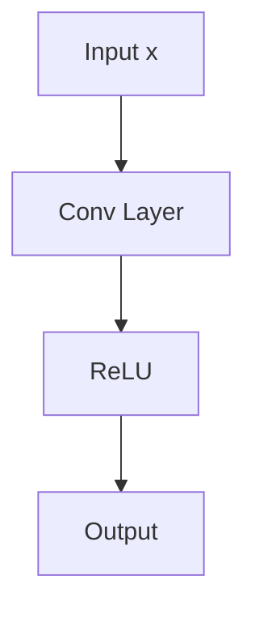
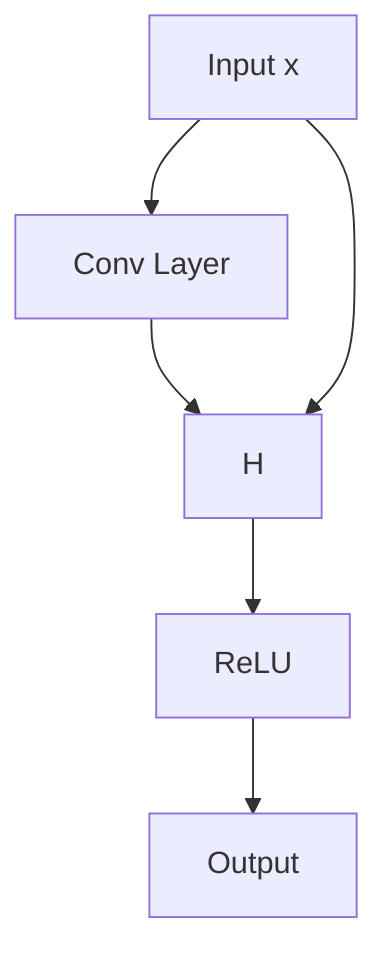

# Lecture 6: CNN Architectures

## History

AlexNet(2012. 8 layers) -> VGG(2014, 16-19 layers) -> GoogLeNet(2014, 22 layers) -> ResNet(2015, **152** layers) -> DenseNet(2016)

### AlexNet & VGG

AlexNet and VGG: 3x3 conv filters, ReLU, max-pooling, and with fully-connected layers at the end; smaller filters, deeper networks. For example, stack of three 3x3 conv layers has same receptive field as one 7x7 conv layer, but with less parameters and more non-linearity.

### Why they only uses few layers?

What happens if we continue stacking deeper layers (on these traditional/plain) CNN?

It turns out that **50 layers CNN performs worse than 20 layers.** It's not caused by overfitting, the possible explanation is that:

1. vanishing/exploding gradients
2. local minima
3. degradation problem: as we add more layers, training error increases.

## Residual Networks(ResNet)

Use network layers to fit a residual mapping instead of the original mapping.

Plain/traditional network:



Identity mapping, ResNet:

<!-- TODO: this prob not correct -->



## Weight Initialization

- value too small -> vanishing gradients
- value too large -> exploding gradients

**Kaiming He Initialization** (for ReLU activations):

```python
import numpy as np


dims = [4096] * 7

hs = []

x = np.random.randn(16, dims[0])

# test for forward pass
for di, do in zip(dims[:-1], dims[:-1]):
  # W = np.random.randn(di, do) * .05  # .1 will overflow .01 will vanish
  W = np.random.randn(di, do) * np.sqrt(2 / di)  # Kaiming He initialization
  x = np.maximum(0, x.dot(W))
  hs.append(x)


# plot each layer's mean and std
for i, h in enumerate(hs):
  print(f"Layer {i + 1}: mean={h.mean():.5f}, std={h.std():.5f}")
```

Possible output:

```log
Layer 1: mean=0.56139, std=0.82481
Layer 2: mean=0.56245, std=0.82461
Layer 3: mean=0.55005, std=0.81188
Layer 4: mean=0.53608, std=0.80365
Layer 5: mean=0.54350, std=0.79697
Layer 6: mean=0.54266, std=0.79811
```

## Hyperparameter Tuning

Hyperparameter tuning is 20% intuition (from ranges above), 30% systematic search (learning rate range test $\to$ grid), and 50% logging/visualization (wandb/tensorboard, see below). Start with proven configs, change one thing at a time, and always compare to a baseline.

### Reasonable Value Ranges

| Optimizer          | Learning Rate | Weight Decay | Momentum         | Other                        |
| ------------------ | ------------- | ------------ | ---------------- | ---------------------------- |
| **SGD**            | 1e-1 to 1e-3  | 1e-4 to 5e-4 | 0.9 (standard)   | `Nesterov=True` often better |
| **SGD + Momentum** | 1e-2 to 1e-3  | 1e-4 to 5e-4 | 0.9–0.95         | Start high, decay            |
| **Adam**           | 3e-4 to 1e-3  | 0 to 5e-4    | β₁=0.9, β₂=0.999 | Default betas usually fine   |
| **AdamW**          | 3e-4 to 1e-3  | 1e-2 to 1e-1 | β₁=0.9, β₂=0.999 | Decoupled weight decay       |
| **RMSprop**        | 1e-4 to 1e-3  | 1e-5 to 5e-4 | 0 or 0.9         | alpha=0.99, eps=1e-8         |

> Note: Adaptive optimizers (Adam, RMSprop) need ~10× smaller LR than SGD because they rescale gradients.

---

### Basic Flowchart

Below take the last assignment of `PyTorch.ipynb` as an example.

#### Sanity Checks

Before any tuning, verify setup: overfit a tiny batch (5-10 samples):

```python
tiny_loader = DataLoader(cifar10_train, batch_size=10, sampler=sampler.SubsetRandomSampler(range(10)))
```

Train for 50-100 iterations with `lr=1e-3`, goal: Training $loss \to 0$, $accuracy \to 100%$, if this fails, probably bug in model, loss, or data.

For 10-class classification with random init:
expected loss: $\log(10) \approx 2.3$. for 10+, check softmax or cross-entropy loss.

#### Learning Rate Range Test

The **Leslie Smith method** (2015): Start with tiny learning rate, multiply by 1.1 every iteration

```python
lrs = []
losses = []
lr = 1e-6
model.train()
for i, (x, y) in enumerate(loader_train):
    if i > 200: break  # iterations enough

    optimizer = torch.optim.SGD(model.parameters(), lr=lr)
    optimizer.zero_grad()
    loss = torch.nn.functional.cross_entropy(model(x.to(device)), y.to(device))
    loss.backward()
    optimizer.step()

    lrs.append(lr)
    losses.append(loss.item())
    lr *= 1.1  # exponential growth

```

Plot `log(lr)` vs loss, pick learning rate where loss drops fastest (i.e., steepest negative slope). Usually it's `1/10` of the learning rate where loss starts exploding.

For CIFAR-10 tasks, specifically:

- SGD: 1e-2, 1e-1
- Adam: 3e-4, 1e-3

#### Coarse Grid Search (most time-consuming part)

Test a few combinations on **1-2 epochs** only.

```python
configs = [
    {'opt': 'sgd', 'lr': 1e-1, 'momentum': 0.9, 'wd': 5e-4},
    {'opt': 'sgd', 'lr': 1e-2, 'momentum': 0.9, 'wd': 5e-4},
    {'opt': 'adam', 'lr': 3e-4, 'wd': 5e-4},
    {'opt': 'adam', 'lr': 1e-3, 'wd': 0},
]

results = {}
for cfg in configs:
    model = build_model()  # fresh start
    optimizer = build_optimizer(model, cfg)
    train(model, optimizer, epochs=2)
    val_acc = check_accuracy(loader_val, model)
    results[str(cfg)] = val_acc
    print(f"{cfg} → {val_acc:.2%}")

```

Pick top 2-3 configs, and **look for**:

- Loss should drop within first 100 iterations
- loss is flat $\to$ learning rate too small
- explodes/NaN $\to$ too large
- Compare val accuracy after 1-2 epochs

#### Fine-Tuning (let model run overnight!)

Take best config, train longer (10-20 epochs) with **learning rate scheduling** (Course didn't mention it so far. ignore this for now maybe).

```python
# 1. Step decay (simple, works well)
scheduler = torch.optim.lr_scheduler.StepLR(optimizer, step_size=30, gamma=0.1)
# Drops learning rate by 10x every 30 epochs

# 2. Cosine annealing (smooth, popular)
scheduler = torch.optim.lr_scheduler.CosineAnnealingLR(optimizer, T_max=epochs)

# 3. ReduceLROnPlateau (adaptive, safe)
scheduler = torch.optim.lr_scheduler.ReduceLROnPlateau(optimizer, 'min', patience=5, factor=0.5)
# Halves learning rate if val loss doesn't improve for 5 epochs.
```

Integrate into training.

```python
def train_with_scheduler(model, optimizer, scheduler, epochs=10):
    for epoch in range(epochs):
        for x, y in loader_train:
            optimizer.zero_grad()
            loss = F.cross_entropy(model(x.to(device)), y.to(device))
            loss.backward()
            optimizer.step()

        # StepLR, CosineAnnealingLR: step scheduler once per epoch
        scheduler.step()

        # ReduceLROnPlateau: step based on val loss
        # val_loss = evaluate(model, loader_val)
        # scheduler.step(val_loss)

        print(f"Epoch {epoch}, LR: {optimizer.param_groups[0]['lr']:.6f}")
```

### Architecture-Specific Rules

| Component             | Hyperparameter | Typical Range                       | Notes                            |
| --------------------- | -------------- | ----------------------------------- | -------------------------------- |
| **Batch size**        | 32–256         | Larger = faster but needs higher LR | Try powers of 2                  |
| **Weight decay**      | 1e-5 to 5e-4   | Higher for large models             | Often 1e-4 or 5e-4               |
| **Dropout**           | 0.1–0.5        | Start 0.2-0.3                       | After conv: ~0.2; after FC: ~0.5 |
| **BatchNorm**         | momentum=0.1   | Default usually fine                | eps=1e-5 standard                |
| **Gradient clipping** | 0.5–5.0        | Use if training unstable            | `torch.nn.utils.clip_grad_norm_` |

---

### Modern Workflow

- **Weights & Biases (wandb)** or **TensorBoard**

  _this is what cs231n professor uses; but it **needs money!** :(_

  ```python
  import wandb
  wandb.init(project="cifar10-tuning")
  wandb.config.update({"lr": 1e-3, "optimizer": "adam"})

  wandb.log({"loss": loss.item(), "acc": acc})
  ```

  - Run 10-20 experiments in parallel
  - Visualize all curves in one dashboard
  - Spot patterns (e.g., "Adam always plateaus at 75%")

- **Ray Tune / Optuna**

  _automated search_

  ```python
  import optuna

  def objective(trial):
      lr = trial.suggest_loguniform('lr', 1e-5, 1e-1)
      wd = trial.suggest_loguniform('wd', 1e-6, 1e-3)

      model = build_model()
      optimizer = torch.optim.Adam(model.parameters(), lr=lr, weight_decay=wd)
      val_acc = train_and_eval(model, optimizer, epochs=5)
      return val_acc

  study = optuna.create_study(direction='maximize')
  study.optimize(objective, n_trials=50)  # tries 50 combinations
  print(study.best_params)
  ```

  - Bayesian optimization (smarter than grid search)
  - Prune bad trials early (saves compute)

- **Paper Ablations**

  _grrrr, maybe last resort?_

  - Start from a known baseline (e.g., ResNet paper's config)
  - Change ONE thing at a time
  - Document what worked/failed

#### For CIFAR-10 specifically

existing research paper shows:

- ResNet: SGD, lr=0.1, momentum=0.9, wd=1e-4, step decay at [150, 250]
- Modern: AdamW, lr=3e-4, wd=0.05, cosine schedule
- Fast: Adam, lr=1e-3, wd=0, no schedule (quick experiments)

Start here, then tweak 2~3 for our own architecture maybe?

### proven to work w.r.t. CIFAR-10

```python
print_every = 10

model = torch.nn.Sequential(
    torch.nn.Conv2d(3, 32, 5, padding=2),
    torch.nn.BatchNorm2d(32),
    torch.nn.ReLU(),
    torch.nn.Conv2d(32, 64, 3, padding=1),
    torch.nn.BatchNorm2d(64),
    torch.nn.ReLU(),
    torch.nn.MaxPool2d(2),
    torch.nn.Conv2d(64, 128, 5, padding=2),
    torch.nn.BatchNorm2d(128),
    torch.nn.ReLU(),
    torch.nn.MaxPool2d(2),
    Flatten(),
    torch.nn.Linear(128 * 8 * 8, 10)
)
optimizer = torch.optim.Adam(model.parameters(), lr=1e-3, weight_decay=1e-4)

```
